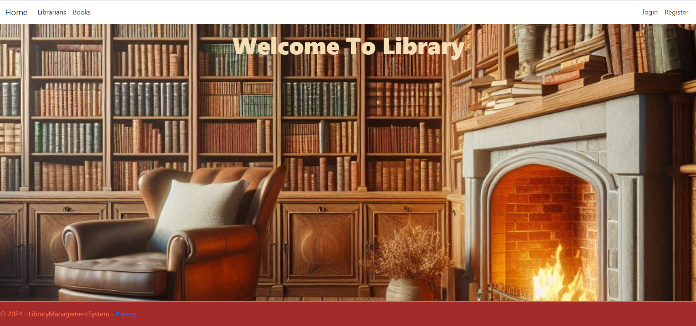

# Library Management System

A Library Management System (LMS) built using ASP.NET Core MVC and SQL Server. This project includes functionalities for managing books, members, transactions, and librarians, along with a custom login and registration system.

## Table of Contents
- [Features](#features)
- [Technologies](#technologies)
- [Installation](#installation)
- [Usage](#usage)
- [Database Design](#database-design)
- [CI/CD Pipeline](#cicd-pipeline)
- [Testing](#testing)

## Features
- User Management: Register, Login, Logout, Role-based access control.
- Book Management: CRUD operations for books, tracking availability and location.
- Member Management: Manage member details, track active and inactive memberships.
- Book Issue/Return: Issue books to members, track return dates, calculate fines.
- Fine Calculation: Automatic fine calculation based on return date.
- Search and Reports: Search features for books, members, transactions, and various reports.

## Technologies
- ASP.NET Core MVC
- Entity Framework Core
- SQL Server
- Azure DevOps
- Bootstrap (for styling)

## Installation
1. Clone the repository:
   ```bash
   git clone https://github.com/your-username/LibraryManagementSystem.git
   cd LibraryManagementSystem
2. Install .NET Core SDK and Visual Studio Code.
3. Set up SQL Server and create a database named LibraryManagementSystem.
4. Run the following commands to scaffold the project and set up the database:
   ```bash
   dotnet restore
   dotnet ef dbcontext scaffold "Server=your_server_name;Database=LibraryManagementSystem;Trusted_Connection=True;TrustServerCertificate=true;" Microsoft.EntityFrameworkCore.SqlServer -o Models
   dotnet ef migrations add InitialCreate
   dotnet ef database update
## Usage
1. Run the application:
   ```bash
   dotnet run
2. Open a browser and navigate to http://localhost:5000.
3. Use the system to manage library resources and users.

## Database Design
The database consists of the following tables:

- Books: Contains book details such as title, author, ISBN, category, published date, and copies available.

- Members: Contains member details such as name, email, address, membership date, and status.

- Transactions: Tracks book issues and returns, including issue date, return date, and fines.

- Librarians: Contains librarian details such as name, email, role, and date joined.

## CI/CD Pipeline
-  Configure Azure DevOps for continuous integration and deployment.

-  Set up build and release pipelines to automate the deployment process.

## Testing
- Unit Tests: Ensure individual components work as expected using xUnit.

- Integration Tests: Test interactions between components and the database.

- End-to-End Tests: Simulate real user scenarios using Selenium.
